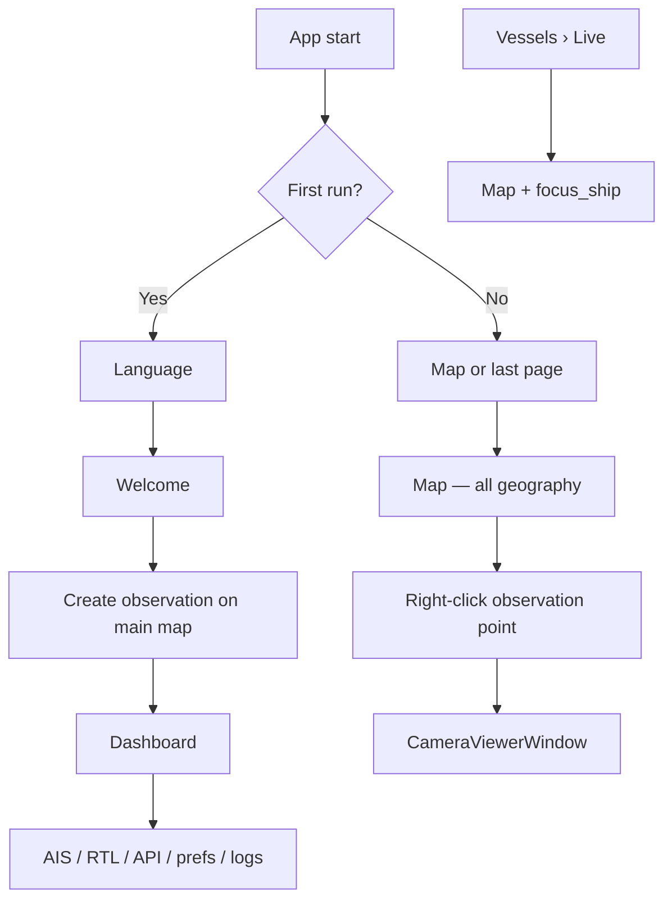

# Project X UI 2.0 — Master Architecture

**Status:** Approved — **Phase 1 complete, awaiting manual verification before Phase 2**  
**Version:** 1.2  
**Date:** 2026-07-08  

This document defines the target UI structure for Project X 2.0. It supersedes the organic layout that grew across eleven sidebar pages and three WebEngine map instances.

---

## 1. Executive summary

UI 2.0 recenters the product on **one map** as the geographic workspace and turns the **Dashboard into an operational control center** that absorbs the former Settings page.

| Area | Today | UI 2.0 |
|------|-------|--------|
| Maps | Three WebEngine surfaces (Live Map, Dashboard observation map, camera/observation wizards) | **One map** for the entire application |
| Observation points | Dashboard card + separate editor map | **Map objects** managed via right-click context menus |
| Settings | Standalone sidebar page | **Merged into Dashboard** — page removed |
| Live Map | Separate sidebar page | **Removed** — functionality merged into the main map |
| Cameras | Empty Cameras page + map sidebar preview | **Bound to observation points**; open in resizable / fullscreen windows |
| Dashboard | Mixed overview + configuration + embedded map | **Control center only** — no map, no geographic editing |

---

## 2. Approved decisions (locked)

The following decisions are **approved** and govern all implementation work.

### 2.1 Single map (Decision 1)

There will be **only one map** in the entire application.

- Remove all duplicate maps.
- Dashboard **no longer contains a map**.
- The observation point editor **no longer opens a second map**.
- Camera position/heading pickers **no longer use a separate map**.
- **Everything related to geography happens on the main map.**

Retire: `ObservationMapWidget`, `CameraMapWidget`, `observation_map.html`, `camera_map.html`, and any Dashboard-embedded map widget.

### 2.2 Observation points are map objects (Decision 2)

Observation points are **not a menu page**.

- They are **objects rendered on the map**.
- All management happens through **right-click context menus** on the map.
- No sidebar entry for “Observation Points.”
- No Dashboard CRUD buttons for observation points.

### 2.3 Dashboard = operational control center (Decision 3)

The Dashboard becomes an **operational control center**.

Merge the current **Settings page into Dashboard**. The standalone Settings page will be **removed**.

Dashboard is responsible for:

| Domain | Responsibility |
|--------|----------------|
| AIS | Configuration and status |
| RTL | Configuration and status |
| API | Configuration and status |
| Language | User language selection |
| General preferences | Vessel card layout, playback, personalization |
| System information | Health summary, diagnostics entry points |
| Statistics | Operational statistics (summary and/or full panels) |
| Alerts | Alert overview / recent events |
| Logs | Application and engine log access |

Dashboard is **not** a geographic workspace. It does not host map widgets or observation-point placement UI.

### 2.4 Cameras belong to observation points (Decision 4)

Cameras belong to **observation points**.

- Camera management remains available in the application.
- Every camera can **optionally** be assigned to an observation point.
- From the map, **right-click observation point** → **Assign camera** / **Open camera**.
- Camera opens in:
  - **Resizable window**
  - **Fullscreen**

Remove the standalone **Cameras** sidebar page (placeholder today). Camera lifecycle is anchored to map objects and Dashboard status summaries.

### 2.5 Empty observation state (Decision 5)

If there are **zero observation points**:

- Show the **world map**.
- **No marker.**
- **No default coordinates.**
- **No Budapest.**
- **No Victoria.**

Deleting the last observation point **always** returns to this empty state.

### 2.6 Multiple observation points (Decision 6)

If **multiple observation points** exist:

- Display **all** observation points on the map.
- **Green** = active.
- **Red** = inactive.

If **more than one observation point is active**, prompt the user to choose **which one** should be used as the **reference point** for distance and bearing calculations.

Implementation note: persist the selected reference (e.g. `reference_observation_id` alongside `active_id` in observation state) and surface the prompt when ambiguity arises (startup, activation change, or before distance/bearing display).

### 2.7 Live Map page removed (Decision 7)

The **Live Map** sidebar page will be **removed**.

Its functionality — ships, trails, vessel popups, camera preview affordances, focus-ship navigation — is **merged into the single main map**.

The sidebar entry becomes **Map** (or equivalent single label), not “Live Map.”

### 2.8 Visual design reference (Decision 8)

A UI concept image shared during planning is **visual inspiration only**. **Do not copy it literally.**

Use it as the reference for:

- **Project X Blue** palette
- Panel styling
- Spacing and density
- Visual hierarchy
- Modern command-center appearance

Functional layout follows **this architecture document**, not a pixel-perfect reproduction of the concept image. Existing `src/gui/theme.py` (Project X Blue) is the code baseline; refine styling toward the concept’s hierarchy and spacing during implementation phases.

---

## 3. Core philosophy

### 3.1 Map as the center

All geographic operations happen on **one map surface**:

- Observation points (create, rename, move, delete, activate, deactivate, assign camera, open camera)
- Ships (live positions, popups, focus, trails)
- Routes and distance / bearing visualization (relative to the chosen reference observation point)
- Camera markers (colocated with or derived from observation points)

**Rule:** If it has latitude/longitude, it is edited and viewed on the **Map** page — nowhere else.

### 3.2 Dashboard as control center

Dashboard answers: *“What is the state of the system, and where do I configure it?”*

It provides status, statistics, alerts, logs, and configuration. It ** launches wizards and dialogs** for AIS, RTL, and API setup. It does **not** duplicate geographic editing.

### 3.3 No duplicate maps

At runtime there is exactly **one** `QWebEngineView` map instance in the main window tree (modal pick modes may reuse the same component instance, not a second HTML surface).

---

## 4. Application shell

```
┌─────────────────────────────────────────────────────────────────┐
│  MainWindow                                                      │
├──────────┬──────────────────────────────────────┬───────────────┤
│ Sidebar  │  QStackedWidget (primary content)     │ Connection   │
│          │                                       │ Panel        │
│  Map     │  Map | Dashboard | Vessels | Alerts │ (persistent) │
│  Dash…   │                                       │              │
│  Vessels │                                       │              │
│  Alerts  │                                       │              │
├──────────┴──────────────────────────────────────┴───────────────┤
│  StatusBar                                                       │
└─────────────────────────────────────────────────────────────────┘

Floating (outside stack):
  • CameraViewerWindow — resizable, optional fullscreen
  • Modal wizards (AIS, RTL, logbook import, etc.)
```

### 4.1 MapController (conceptual singleton)

| Responsibility | Owner |
|----------------|-------|
| Single `QWebEngineView` + unified `map.html` | Map page only |
| Ship layer | Engine → map bridge |
| All observation markers (green / red) | `ObservationManager` → map bridge |
| Camera markers / actions | Camera registry → map bridge |
| Context menus (JS ↔ Python) | `MapController` |
| Pick modes for wizards | `MapController.set_mode(...)` on **same** map |
| Empty world view | Canonical zero-state (Decision 5) |
| Reference observation for distance/bearing | User prompt when multiple active (Decision 6) |

Other pages call `MainWindow.navigate_to_map(...)` or `MapController` APIs — they never construct map widgets.

---

## 5. Menu hierarchy

### 5.1 Sidebar — target top-level items

| # | Label | Role |
|---|-------|------|
| 0 | **Map** | Sole geographic workspace (replaces Live Map) |
| 1 | **Dashboard** | Operational control center + former Settings |
| 2 | **Vessels** | Live list, database, timeline, detailed statistics (tabbed hub) |
| 3 | **Alerts** | Events + rules (tabbed hub) |

**Not in sidebar:** Observation Points (map objects), Settings (merged), Live Map (merged), Cameras page (removed), System Health as top-level (merged into Dashboard system panel).

### 5.2 Menu migration table

| Current item | Verdict |
|--------------|---------|
| Dashboard | **Keep** — redesign as control center |
| Live Map | **Remove** — merge into Map |
| Vessels | **Keep** — tab “Live” inside Vessels hub |
| Cameras | **Remove** — cameras on map + Dashboard summary |
| Vessel Database | **Merge** → Vessels › Database |
| Vessel Timeline | **Merge** → Vessels › Timeline |
| Statistics | **Merge** → Dashboard (overview) + Vessels › Statistics (detail) |
| Alert Center | **Merge** → Alerts › Events |
| Alert Rules | **Merge** → Alerts › Rules |
| Settings | **Remove** → Dashboard configuration panels |
| System Health | **Merge** → Dashboard › System information |

### 5.3 Connection panel

Keep as **persistent right rail** for live connectivity (Internet, AIS, RTL, GPS, Camera, Database, API). Dashboard mirrors the same domains in panel form for control-center overview; avoid duplicating conflicting controls — shared handlers behind both surfaces.

---

## 6. Screen responsibilities

### 6.1 Map

**Purpose:** All geographic interaction.

**Empty state (zero observation points):** World view, no markers, no default cities (Decision 5).

**Right-click — empty map:**

| Action | Behavior |
|--------|----------|
| Create observation point | Name (+ optional camera later) at click coordinates |

**Right-click — observation point:**

| Action | Behavior |
|--------|----------|
| Rename | Dialog or inline edit |
| Move | Drag or pick new location on same map |
| Delete | Confirm; last point → empty world state |
| Activate | Set active; may trigger reference prompt (Decision 6) |
| Deactivate | Set inactive; marker turns red |
| Assign camera | Camera assign flow (optional binding) |
| Open camera | `CameraViewerWindow` — resizable / fullscreen |

**Marker styling:** Green = active, Red = inactive (Decision 6). All points visible when count > 0.

**Ships:** Preserve vessel popups, `focus_ship(mmsi)` from Vessels hub, trails on map layer.

**Distance / bearing:** Computed from the **user-selected reference observation point** when multiple are active.

**Retired from other pages:** All map widgets, Live Map page, observation editor map, camera wizard map.

### 6.2 Dashboard

**Purpose:** Operational control center (Decision 3). **No map.**

Scrollable panel grid (`QScrollArea`). Panels include:

| Panel | Content |
|-------|---------|
| System information | Health summary, diagnostics links |
| AIS | Status + configure |
| RTL | Status + configure |
| API | Status + configure |
| Cameras | Summary (counts, online/offline); “Manage on Map” navigation |
| Database | Registry / DB status |
| Language | Former Settings language combo |
| General preferences | Vessel card layout, playback settings |
| Camera diagnostics | Former Settings diagnostics table |
| Statistics | Operational stats |
| Alerts | Recent events snapshot |
| Logs | Log tail / viewer |
| Logbook import | Non-geographic import (retain if still required operationally) |

**Removed from Dashboard:** Embedded map, observation-point map editor, direct observation CRUD buttons.

### 6.3 Vessels hub

Tabbed page: **Live** | **Database** | **Timeline** | **Statistics** (detail).

- Live tab: ship list → click navigates to Map + `focus_ship`.
- Database / Timeline: “Show on map” where coordinates exist.

### 6.4 Alerts hub

Tabbed page: **Events** | **Rules**.

Dashboard shows Events snapshot; full management on Alerts page.

### 6.5 Cameras (no page)

Cameras are managed through:

- Map context menu on observation points (assign / open)
- Dashboard camera summary and diagnostics
- Optional global camera list in Dashboard **without** a dedicated sidebar page

Playback: **CameraViewerWindow** with resize and fullscreen (Decision 4).

---

## 7. Navigation flow

### 7.1 Startup and first run

| Step | Screen | Notes |
|------|--------|-------|
| 1 | Language | Language selection first |
| 2 | Welcome | Product introduction |
| 3 | Observation point | Create first point via **main map pick mode** (same map component — not a second map) |
| 4 | Dashboard | First-run completion lands here |

AIS, RTL, and camera assignment are **not** first-run wizard steps; user configures them from Dashboard afterward.

### 7.2 Primary navigation diagram



### 7.3 MainWindow navigation API (conceptual)

```python
navigate(page: PageId, *, map_action: MapAction | None = None)
focus_ship(mmsi: str)
open_camera(observation_id: str, *, fullscreen: bool = False)
enter_map_pick_mode(mode: PickMode, callback)  # same map instance
resolve_reference_observation()  # prompt if multiple active
```

---

## 8. Data and state model

### 8.1 Observation points

| Concern | Rule |
|---------|------|
| Storage | `observation_points.json` (runtime config) |
| Active flag | Green marker |
| Inactive flag | Red marker |
| Multiple active | User must choose reference for distance/bearing |
| Zero points | World map, no defaults |
| Delete last | Return to empty world state |

Extend persistence as needed: `active_id`, `reference_id` (for distance/bearing), explicit multi-active handling.

### 8.2 Cameras

Optional `camera_id` (or inline camera config) on each observation point. Unassigned cameras may still exist in registry but map actions require an observation anchor for assign/open from context menu.

### 8.3 Configuration split

| Data | Edited from |
|------|-------------|
| Observation geometry & flags | Map context menus |
| AIS / RTL / API | Dashboard panels → wizards |
| Language & preferences | Dashboard › Configuration |
| Alert rules | Alerts › Rules |

---

## 9. Component retirement list

| Component | Action |
|-----------|--------|
| `ObservationMapWidget` / `observation_map.html` | Delete after merge |
| `CameraMapWidget` / `camera_map.html` | Delete after merge |
| Dashboard embedded map | Remove |
| `SettingsPage` as nav target | Dissolve into Dashboard |
| `CamerasPage` | Remove |
| Live Map as separate page | Remove — rename/replace with Map |
| `SystemHealthPage` as nav target | Merge into Dashboard |
| Default Budapest / Victoria coordinates | Remove everywhere |

---

## 10. Visual design (Decision 8)

Implementation styling targets:

- **Project X Blue** — primary accent `#1976d2` family (see `src/gui/theme.py`)
- **Panel cards** — dark surfaces, subtle borders, section labels consistent with command-center density
- **Spacing** — generous padding in Dashboard panels; map remains edge-to-edge primary content
- **Hierarchy** — Map and Dashboard are co-primary; Vessels and Alerts are analytical depth pages

The shared concept image informs **look and feel**, not layout cloning.

---

## 11. Migration plan

### Phase 1 — Map singleton

1. Introduce `MapController` and unified `map.html`.
2. Merge observation layer (all markers, green/red, context menus).
3. Merge Live Map ship layer and popups.
4. Implement empty world state (Decision 5).
5. Implement multi-active reference prompt (Decision 6).

**Exit:** One map instance; Live Map page redundant.

### Phase 2 — Dashboard control center

1. Remove Dashboard map and observation CRUD.
2. Move Settings panels into Dashboard.
3. Move System Health into Dashboard.
4. Add statistics, alerts, logs panels.
5. Remove Settings from sidebar.

**Exit:** Settings page unreachable; Dashboard covers Decision 3 scope.

### Phase 3 — Menu consolidation

1. Vessels hub (tabs).
2. Alerts hub (tabs).
3. Remove Live Map, Cameras, Settings, System Health sidebar entries.
4. Reindex sidebar and `MainWindow` stack.

**Exit:** Four-item sidebar matches §5.1.

### Phase 4 — Cameras and first run

1. `CameraViewerWindow` (resizable + fullscreen).
2. Map context menu: assign / open camera.
3. First-run: Language → Welcome → Observation (map pick) → Dashboard.
4. Wizard flows use `enter_map_pick_mode` — no second map.

**Exit:** Decisions 4 and first-run flow satisfied.

### Phase 5 — Cleanup

1. Delete retired widgets and HTML.
2. i18n for new strings (context menus, reference prompt).
3. Update user-facing docs.
4. Regression: packaged build, runtime data dirs, empty state, multi-active edge cases.

---

## 12. Implementation order

| Order | Task | Depends on |
|-------|------|------------|
| 1 | Map singleton + unified HTML | — |
| 2 | Context menus + all markers + green/red | 1 |
| 3 | Multi-active reference prompt + distance/bearing wiring | 2 |
| 4 | Remove Dashboard map; strip obs CRUD from Dashboard | 1 |
| 5 | Merge Settings + System Health into Dashboard | 4 |
| 6 | Remove Live Map page; rename sidebar to Map | 1 |
| 7 | Vessels + Alerts hubs | 6 |
| 8 | CameraViewerWindow + map camera actions | 1 |
| 9 | First-run simplification + map pick mode | 1, 8 |
| 10 | Delete dead code and duplicate HTML | 1–9 |

**Critical path:** Map singleton (Phase 1) before Dashboard or menu work.

---

## 13. Acceptance criteria

- [ ] Exactly **one** map instance in the application (Decision 1)
- [ ] Observation points managed **only** via map context menus — no menu page (Decision 2)
- [ ] Dashboard is control center with AIS, RTL, API, language, prefs, system info, statistics, alerts, logs — **no map** (Decision 3)
- [ ] Settings sidebar page **removed** (Decision 3)
- [ ] Cameras assignable to observation points; open resizable + fullscreen from map (Decision 4)
- [ ] Zero observation points → world view, no default coords (Decision 5)
- [ ] All observation points shown; green/red; multi-active reference prompt (Decision 6)
- [ ] Live Map page **removed**; functionality on main map (Decision 7)
- [ ] Visual polish follows Project X Blue command-center direction — concept image as inspiration only (Decision 8)
- [ ] No regression to runtime data bootstrap, i18n, or engine connectivity

---

## 14. Status and next step

**Architecture:** Approved with decisions §2.1–§2.8 locked.  
**Phase 1 (Map singleton):** Implemented — pending manual verification.  
**Phase 2 (Dashboard control center):** Not started — blocked until Phase 1 sign-off.

### Phase 1 deliverables (2026-07-08)

- `MapController` singleton owns the sole main-window map widget on Live Map page
- Unified `map.html` renders all observation points (green active / red inactive)
- Right-click context menus on map: create, rename, move, delete, activate, deactivate, assign camera, open camera
- Empty state: world view with no default coordinates
- `reference_id` persisted in `observation_points.json` (schema v2)
- Reference observation prompt when multiple points are active

**Known gap until Phase 2:** Dashboard still embeds `ObservationMapWidget` (second map instance). Removed in Phase 2.

---

## Appendix A — Current vs target index map

| Current sidebar index | Page | Target |
|----------------------|------|--------|
| 0 | Dashboard | Dashboard (redesigned) |
| 1 | Live Map | **Map** (merged) |
| 2 | Vessels | Vessels hub › Live |
| 3 | Cameras | *Removed* |
| 4 | Vessel Database | Vessels hub › Database |
| 5 | Vessel Timeline | Vessels hub › Timeline |
| 6 | Statistics | Dashboard + Vessels hub › Statistics |
| 7 | Alert Center | Alerts hub › Events |
| 8 | Alert Rules | Alerts hub › Rules |
| 9 | Settings | Dashboard panels |
| 10 | System Health | Dashboard › System information |
