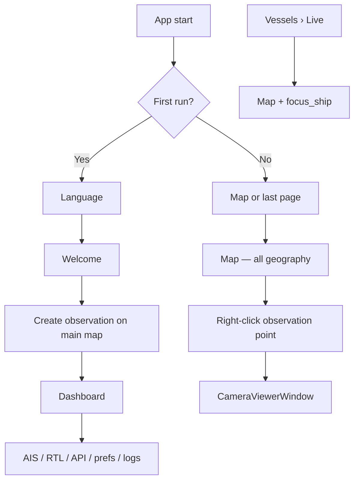

# Project X UI 2.0 — Master Architecture

**Status:** Phase 1 complete — **Phase 2 (Map Core) complete**  
**Version:** 1.5  
**Date:** 2026-07-08  

This document defines the target UI structure for Project X 2.0. It supersedes the organic layout that grew across eleven sidebar pages and three WebEngine map instances.

---

## 1. Executive summary

UI 2.0 recenters the product on **one map** as the geographic workspace and turns the **Dashboard into an operational control center** that absorbs the former Settings page.

| Area | Today | UI 2.0 |
|------|-------|--------|
| Maps | Three WebEngine surfaces (Live Map, Dashboard observation map, camera/observation wizards) | **One map** for the entire application |
| Observation points | Dashboard card + separate editor map | **Map objects** managed via right-click context menus |
| Settings | Standalone sidebar page | **Merged into Dashboard** — page removed |
| Live Map | Separate sidebar page | **Removed** — functionality merged into the main map |
| Cameras | Empty Cameras page + map sidebar preview | **Bound to observation points**; open in resizable / fullscreen windows |
| Dashboard | Mixed overview + configuration + embedded map | **Control center only** — no map, no geographic editing |

---

## 2. Approved decisions (locked)

The following decisions are **approved** and govern all implementation work.

### 2.1 Single map (Decision 1)

There will be **only one map** in the entire application.

- Remove all duplicate maps.
- Dashboard **no longer contains a map**.
- The observation point editor **no longer opens a second map**.
- Camera position/heading pickers **no longer use a separate map**.
- **Everything related to geography happens on the main map.**

Retire: `ObservationMapWidget`, `CameraMapWidget`, `observation_map.html`, `camera_map.html`, and any Dashboard-embedded map widget.

### 2.2 Observation points are map objects (Decision 2)

Observation points are **not a menu page**.

- They are **objects rendered on the map**.
- All management happens through **right-click context menus** on the map.
- No sidebar entry for “Observation Points.”
- No Dashboard CRUD buttons for observation points.

### 2.3 Dashboard = operational control center (Decision 3)

The Dashboard becomes an **operational control center**.

Merge the current **Settings page into Dashboard**. The standalone Settings page will be **removed**.

Dashboard is responsible for:

| Domain | Responsibility |
|--------|----------------|
| AIS | Configuration and status |
| RTL | Configuration and status |
| API | Configuration and status |
| Language | User language selection |
| General preferences | Vessel card layout, playback, personalization |
| System information | Health summary, diagnostics entry points |
| Statistics | Operational statistics (summary and/or full panels) |
| Alerts | Alert overview / recent events |
| Logs | Application and engine log access |

Dashboard is **not** a geographic workspace. It does not host map widgets or observation-point placement UI.

### 2.4 Cameras belong to observation points (Decision 4)

Cameras belong to **observation points**.

- Camera management remains available in the application.
- Every camera can **optionally** be assigned to an observation point.
- From the map, **right-click observation point** → **Assign camera** / **Open camera**.
- Camera opens in:
  - **Resizable window**
  - **Fullscreen**

Remove the standalone **Cameras** sidebar page (placeholder today). Camera lifecycle is anchored to map objects and Dashboard status summaries.

### 2.5 Empty observation state (Decision 5)

If there are **zero observation points**:

- Show the **world map**.
- **No marker.**
- **No default coordinates.**
- **No Budapest.**
- **No Victoria.**

Deleting the last observation point **always** returns to this empty state.

### 2.6 Multiple observation points (Decision 6)

If **multiple observation points** exist:

- Display **all** observation points on the map.
- **Green** = active.
- **Red** = inactive.

If **more than one observation point is active**, prompt the user to choose **which one** should be used as the **reference point** for distance and bearing calculations.

Implementation note: persist the selected reference (e.g. `reference_observation_id` alongside `active_id` in observation state) and surface the prompt when ambiguity arises (startup, activation change, or before distance/bearing display).

### 2.7 Live Map retired — one central Map (Decision 7)

The legacy **Live Map** page is **retired**, not renamed.

UI 2.0 establishes **one central Map** for the entire application. This is an **architectural change**:

- There is no separate “Live Map” product surface.
- Ships, trails, vessel popups, camera preview affordances, and `focus_ship` navigation belong to **the Map** — the geographic workspace owned by `MapController`.
- The sidebar label **Map** names that workspace; it is **not** a cosmetic rename of “Live Map.”
- All code paths that implied a second map or a “live” variant are removed or redirected through `MapController`.

**Implement Phase 2 as:** **Map Core** — one map architecture, no duplicate map surfaces, observation creation on the main map, no secondary map dialogs. This is **not** a sidebar rename and **not** observation context menus or camera integration (deferred to later phases).

See §11 Phase 2 — Map Core.

### 2.8 Visual design reference (Decision 8)

A UI concept image shared during planning is **visual inspiration only**. **Do not copy it literally.**

Use it as the reference for:

- **Project X Blue** palette
- Panel styling
- Spacing and density
- Visual hierarchy
- Modern command-center appearance

Functional layout follows **this architecture document**, not a pixel-perfect reproduction of the concept image. Existing `src/gui/theme.py` (Project X Blue) is the code baseline; refine styling toward the concept’s hierarchy and spacing during implementation phases.

---

## 3. Core philosophy

### 3.1 Map as the center

All geographic operations happen on **one map surface**:

- Observation points (create, rename, move, delete, activate, deactivate, assign camera, open camera)
- Ships (live positions, popups, focus, trails)
- Routes and distance / bearing visualization (relative to the chosen reference observation point)
- Camera markers (colocated with or derived from observation points)

**Rule:** If it has latitude/longitude, it is edited and viewed on the **Map** page — nowhere else.

### 3.2 Dashboard as control center

Dashboard answers: *“What is the state of the system, and where do I configure it?”*

It provides status, statistics, alerts, logs, and configuration. It ** launches wizards and dialogs** for AIS, RTL, and API setup. It does **not** duplicate geographic editing.

### 3.3 No duplicate maps

At runtime there is exactly **one** `QWebEngineView` map instance in the main window tree (modal pick modes may reuse the same component instance, not a second HTML surface).

---

## 4. Application shell

```
┌─────────────────────────────────────────────────────────────────┐
│  MainWindow                                                      │
├──────────┬──────────────────────────────────────┬───────────────┤
│ Sidebar  │  QStackedWidget (primary content)     │ Connection   │
│          │                                       │ Panel        │
│  Map     │  Map | Dashboard | Vessels | Alerts │ (persistent) │
│  Dash…   │                                       │              │
│  Vessels │                                       │              │
│  Alerts  │                                       │              │
├──────────┴──────────────────────────────────────┴───────────────┤
│  StatusBar                                                       │
└─────────────────────────────────────────────────────────────────┘

Floating (outside stack):
  • CameraViewerWindow — resizable, optional fullscreen
  • Modal wizards (AIS, RTL, logbook import, etc.)
```

### 4.1 MapController (conceptual singleton)

| Responsibility | Owner |
|----------------|-------|
| Single `QWebEngineView` + unified `map.html` | Map page only |
| Ship layer | Engine → map bridge |
| All observation markers (green / red) | `ObservationManager` → map bridge |
| Camera markers / actions | Camera registry → map bridge |
| Context menus (JS ↔ Python) | `MapController` |
| Pick modes for wizards | `MapController.set_mode(...)` on **same** map |
| Empty world view | Canonical zero-state (Decision 5) |
| Reference observation for distance/bearing | User prompt when multiple active (Decision 6) |

Other pages call `MainWindow.navigate_to_map(...)` or `MapController` APIs — they never construct map widgets.

---

## 5. Menu hierarchy

### 5.1 Sidebar — target top-level items

| # | Label | Role |
|---|-------|------|
| 0 | **Map** | The central geographic workspace (`MapController` host — not a renamed Live Map) |
| 1 | **Dashboard** | Operational control center + former Settings |
| 2 | **Vessels** | Live list, database, timeline, detailed statistics (tabbed hub) |
| 3 | **Alerts** | Events + rules (tabbed hub) |

**Not in sidebar:** Observation Points (map objects), Settings (merged), Live Map (merged), Cameras page (removed), System Health as top-level (merged into Dashboard system panel).

### 5.2 Menu migration table

| Current item | Verdict |
|--------------|---------|
| Dashboard | **Keep** — redesign as control center |
| Live Map | **Retire** — functionality lives on the central Map; not a page rename |
| Vessels | **Keep** — tab “Live” inside Vessels hub |
| Cameras | **Remove** — cameras on map + Dashboard summary |
| Vessel Database | **Merge** → Vessels › Database |
| Vessel Timeline | **Merge** → Vessels › Timeline |
| Statistics | **Merge** → Dashboard (overview) + Vessels › Statistics (detail) |
| Alert Center | **Merge** → Alerts › Events |
| Alert Rules | **Merge** → Alerts › Rules |
| Settings | **Remove** → Dashboard configuration panels |
| System Health | **Merge** → Dashboard › System information |

### 5.3 Connection panel

Keep as **persistent right rail** for live connectivity (Internet, AIS, RTL, GPS, Camera, Database, API). Dashboard mirrors the same domains in panel form for control-center overview; avoid duplicating conflicting controls — shared handlers behind both surfaces.

---

## 6. Screen responsibilities

### 6.1 Map

**Purpose:** All geographic interaction.

**Empty state (zero observation points):** World view, no markers, no default cities (Decision 5).

**Right-click — empty map:**

| Action | Behavior |
|--------|----------|
| Create observation point | Name (+ optional camera later) at click coordinates |

**Right-click — observation point:**

| Action | Behavior |
|--------|----------|
| Rename | Dialog or inline edit |
| Move | Drag or pick new location on same map |
| Delete | Confirm; last point → empty world state |
| Activate | Set active; may trigger reference prompt (Decision 6) |
| Deactivate | Set inactive; marker turns red |
| Assign camera | Camera assign flow (optional binding) |
| Open camera | `CameraViewerWindow` — resizable / fullscreen |

**Marker styling:** Green = active, Red = inactive (Decision 6). All points visible when count > 0.

**Ships:** Preserve vessel popups, `focus_ship(mmsi)` from Vessels hub, trails on map layer.

**Distance / bearing:** Computed from the **user-selected reference observation point** when multiple are active.

**Retired from other pages:** All map widgets, Live Map page, observation editor map, camera wizard map.

### 6.2 Dashboard

**Purpose:** Operational control center (Decision 3). **No map.**

Scrollable panel grid (`QScrollArea`). Panels include:

| Panel | Content |
|-------|---------|
| System information | Health summary, diagnostics links |
| AIS | Status + configure |
| RTL | Status + configure |
| API | Status + configure |
| Cameras | Summary (counts, online/offline); “Manage on Map” navigation |
| Database | Registry / DB status |
| Language | Former Settings language combo |
| General preferences | Vessel card layout, playback settings |
| Camera diagnostics | Former Settings diagnostics table |
| Statistics | Operational stats |
| Alerts | Recent events snapshot |
| Logs | Log tail / viewer |
| Logbook import | Non-geographic import (retain if still required operationally) |

**Removed from Dashboard:** Embedded map, observation-point map editor, direct observation CRUD buttons.

### 6.3 Vessels hub

Tabbed page: **Live** | **Database** | **Timeline** | **Statistics** (detail).

- Live tab: ship list → click navigates to Map + `focus_ship`.
- Database / Timeline: “Show on map” where coordinates exist.

### 6.4 Alerts hub

Tabbed page: **Events** | **Rules**.

Dashboard shows Events snapshot; full management on Alerts page.

### 6.5 Cameras (no page)

Cameras are managed through:

- Map context menu on observation points (assign / open)
- Dashboard camera summary and diagnostics
- Optional global camera list in Dashboard **without** a dedicated sidebar page

Playback: **CameraViewerWindow** with resize and fullscreen (Decision 4).

---

## 7. Navigation flow

### 7.1 Startup and first run

| Step | Screen | Notes |
|------|--------|-------|
| 1 | Language | Language selection first |
| 2 | Welcome | Product introduction |
| 3 | Observation point | Create first point via **main map pick mode** (same map component — not a second map) |
| 4 | Dashboard | First-run completion lands here |

AIS, RTL, and camera assignment are **not** first-run wizard steps; user configures them from Dashboard afterward.

### 7.2 Primary navigation diagram



### 7.3 MainWindow navigation API (conceptual)

```python
navigate(page: PageId, *, map_action: MapAction | None = None)
focus_ship(mmsi: str)
open_camera(observation_id: str, *, fullscreen: bool = False)
enter_map_pick_mode(mode: PickMode, callback)  # same map instance
resolve_reference_observation()  # prompt if multiple active
```

---

## 8. Data and state model

### 8.1 Observation points

| Concern | Rule |
|---------|------|
| Storage | `observation_points.json` (runtime config) |
| Active flag | Green marker |
| Inactive flag | Red marker |
| Multiple active | User must choose reference for distance/bearing |
| Zero points | World map, no defaults |
| Delete last | Return to empty world state |

Extend persistence as needed: `active_id`, `reference_id` (for distance/bearing), explicit multi-active handling.

### 8.2 Cameras

Optional `camera_id` (or inline camera config) on each observation point. Unassigned cameras may still exist in registry but map actions require an observation anchor for assign/open from context menu.

### 8.3 Configuration split

| Data | Edited from |
|------|-------------|
| Observation geometry & flags | Map context menus |
| AIS / RTL / API | Dashboard panels → wizards |
| Language & preferences | Dashboard › Configuration |
| Alert rules | Alerts › Rules |

---

## 9. Component retirement list

| Component | Action |
|-----------|--------|
| `ObservationMapWidget` / `observation_map.html` | Delete after merge |
| `CameraMapWidget` / `camera_map.html` | Delete after merge |
| Dashboard embedded map | Remove |
| `SettingsPage` as nav target | Dissolve into Dashboard |
| `CamerasPage` | Remove |
| Live Map as separate page | Retire — central Map is the only geographic page |
| `SystemHealthPage` as nav target | Merge into Dashboard |
| Default Budapest / Victoria coordinates | Remove everywhere |

---

## 10. Visual design (Decision 8)

Implementation styling targets:

- **Project X Blue** — primary accent `#1976d2` family (see `src/gui/theme.py`)
- **Panel cards** — dark surfaces, subtle borders, section labels consistent with command-center density
- **Spacing** — generous padding in Dashboard panels; map remains edge-to-edge primary content
- **Hierarchy** — Map and Dashboard are co-primary; Vessels and Alerts are analytical depth pages

The shared concept image informs **look and feel**, not layout cloning.

---

## 11. Migration plan

### Phase 1 — Map singleton + Dashboard control center ✅ COMPLETE

1. Introduce `MapController` and unified `map.html`.
2. Merge observation layer (all markers, green/red, context menus).
3. Merge ship layer and popups onto the singleton map surface.
4. Implement empty world state (Decision 5).
5. Implement multi-active reference prompt (Decision 6).
6. Remove Dashboard embedded map; merge Settings into Dashboard Configuration.
7. Remove Settings from sidebar; reindex System Health.

**Exit:** One `QWebEngineView` map instance in the app; Dashboard is operational control center; Settings page unreachable from navigation.

**Commits:** `82888a9`, `4d79e21`, `0658fa0` (map singleton), `UI2-004` (dashboard control center).

---

### Phase 2 — Map Core

**Phase 2 is not “Live Map rename”.**  
**Phase 2 is Map Core:** establish the map as the **central geographic workspace** of Project X.

#### Objectives

| # | Objective |
|---|-----------|
| 1 | **One Map Architecture** — exactly one map instance and one map code path in the running application |
| 2 | **Remove duplicated maps** — delete or retire all secondary map widgets and HTML surfaces |
| 3 | **Dashboard has no map** — already satisfied in Phase 1; verify and guard against regression |
| 4 | **Observation Point creation uses the main map** — wizards and create flows use `MapController` pick mode on the singleton map, not embedded map dialogs |
| 5 | **No secondary map dialogs** — no `ObservationMapWidget`, `CameraMapWidget`, or wizard-embedded `QWebEngineView` map surfaces |
| 6 | **No duplicated map logic** — one bridge, one `map.html`, one refresh/navigation contract |
| 7 | **Map = single geographic workspace** — all latitude/longitude viewing and placement routes through the central map page |

#### In scope (Map Core only)

| Step | Work |
|------|------|
| 2.1 | **`MainWindow.navigate_to_map(action=...)`** — single geographic navigation API; all callers (`focus_ship`, System Health, menubar, wizards) use it |
| 2.2 | **`MapController` as sole owner** — one `QWebEngineView`, one `map.html`; map page hosts `MapController.widget()` as the central workspace |
| 2.3 | **Eliminate duplicate map surfaces** — remove `ObservationMapWidget`, `CameraMapWidget`, `observation_map.html`, `camera_map.html` from active code paths |
| 2.4 | **Observation creation on main map** — `ObservationWizard`, first-run, and Dashboard “Create” navigate to / use main-map pick mode instead of a secondary map |
| 2.5 | **Retire Live Map as a product concept** — refactor naming (`MapPage`, sidebar **Map**, i18n) to reflect central workspace architecture, not a cosmetic rename |
| 2.6 | **Consolidate map logic** — merge any remaining split refresh/update paths into `MapController`; remove parallel observation rendering APIs |

#### Explicitly out of scope for Phase 2

| Item | Deferred to |
|------|-------------|
| Observation Point **context menus** (rename, move, delete, activate, deactivate on map) | Phase 3 |
| **Camera** integration on map (assign, open, markers, playback) | Phase 4 |
| Vessels / Alerts hub consolidation | Phase 3 |
| Dashboard observation CRUD removal | Phase 3 |
| `CameraViewerWindow` | Phase 4 |

**Note on Phase 1:** Phase 1 introduced early map context-menu code on the singleton surface. Phase 2 **does not extend** that work. Map Core focuses on architecture consolidation only; context-menu behavior is finalized in Phase 3.

#### Exit criteria

- [x] Exactly **one** `QWebEngineView` map in the application at runtime
- [x] **Zero** active code paths loading `observation_map.html` or `camera_map.html`
- [x] **Zero** wizard or dialog hosts a second map widget
- [x] Observation Point **creation** works via main-map pick mode (`MapController`)
- [x] Dashboard contains **no** map widget
- [x] All geographic navigation uses `navigate_to_map` / `MapController`
- [x] Live Map retired as architecture — sidebar shows **Map** as central workspace, not a renamed page
- [ ] Ships layer and existing map display **without regression** *(manual test)*
- [x] **No** new observation context menus implemented in this phase
- [x] **No** camera map integration implemented in this phase

---

### Phase 3 — Observation map interactions

1. Observation Point context menus on the central map (create on empty map, rename, move, delete, activate, deactivate).
2. Multi-marker display (green/red) and reference observation prompt (if not fully consolidated in Phase 1).
3. Remove observation-point CRUD from Dashboard (summary only).
4. Vessels hub (tabs: Live, Database, Timeline, Statistics).
5. Alerts hub (tabs: Events, Rules).
6. Remove Cameras sidebar page; merge System Health summary into Dashboard.
7. Reindex sidebar toward four top-level items (Map, Dashboard, Vessels, Alerts).

**Exit:** Observation management on map via context menus; menu consolidation underway.

---

### Phase 4 — Cameras and first run

1. `CameraViewerWindow` (resizable + fullscreen).
2. Map context menu: assign camera / open camera (full playback).
3. Camera wizard position/heading pick via main-map pick mode.
4. First-run: Language → Welcome → Observation (main map pick) → Dashboard.

**Exit:** Decisions 4 and camera-on-map flow satisfied.

---

### Phase 5 — Cleanup

1. Delete retired widgets and HTML (`ObservationMapWidget`, `observation_map.html`, `camera_map.html`, unused `SettingsPage` host).
2. i18n pass for remaining legacy strings.
3. Update user-facing docs.
4. Regression: packaged build, runtime data dirs, empty state, multi-active edge cases.

---

## 12. Implementation order

| Order | Task | Phase | Depends on |
|-------|------|-------|------------|
| 1 | Map singleton + unified HTML | 1 ✅ | — |
| 2 | Multi-marker observation layer + reference model | 1 ✅ | 1 |
| 3 | Dashboard control center + Settings merge | 1 ✅ | 1 |
| 4 | `navigate_to_map` + MapController ownership contract | 2 | 1 |
| 5 | Remove duplicate map widgets/HTML from wizards | 2 | 4 |
| 6 | Observation **creation** via main-map pick mode | 2 | 4, 5 |
| 7 | Retire Live Map architecture (naming, entry points) | 2 | 4 |
| 8 | Consolidate map refresh logic into MapController | 2 | 4 |
| 9 | Observation context menus on central map | 3 | 2 |
| 10 | Menu consolidation (Vessels/Alerts hubs) | 3 | 2 |
| 11 | Dashboard observation CRUD removal | 3 | 9 |
| 12 | CameraViewerWindow + camera map actions | 4 | 2 |
| 13 | First-run + camera wizard on main map | 4 | 6, 12 |
| 14 | Delete dead code; full regression | 5 | 1–13 |

**Critical path for Phase 2 (Map Core):** eliminate duplicate maps → main-map observation creation → `navigate_to_map` — **before** context menus or cameras.

---

## 13. Acceptance criteria

- [ ] Exactly **one** map instance in the application (Decision 1)
- [ ] Observation points managed **only** via map context menus — no menu page (Decision 2)
- [ ] Dashboard is control center with AIS, RTL, API, language, prefs, system info, statistics, alerts, logs — **no map** (Decision 3)
- [ ] Settings sidebar page **removed** (Decision 3)
- [ ] Cameras assignable to observation points; open resizable + fullscreen from map (Decision 4)
- [ ] Zero observation points → world view, no default coords (Decision 5)
- [ ] All observation points shown; green/red; multi-active reference prompt (Decision 6)
- [ ] **Central Map** established — Live Map page retired, not renamed (Decision 7)
- [ ] Visual polish follows Project X Blue command-center direction — concept image as inspiration only (Decision 8)
- [ ] No regression to runtime data bootstrap, i18n, or engine connectivity

---

## 14. Status and next step

**Architecture:** Approved with decisions §2.1–§2.8 locked.  
**Phase 1:** ✅ Complete and committed.  
**Phase 2 (Map Core):** ✅ Complete and committed (manual test BUG-TEST-002 pass).  
**Phase 3+:** Not started.

### Phase 1 deliverables (committed)

**Map singleton (`82888a9`–`0658fa0`)**
- `MapController` singleton owns the sole `QWebEngineView` in the main window
- Unified `map.html`: observation markers, ships, empty world state
- `reference_id` in `observation_points.json` (schema v2)
- Early context-menu prototype (not extended in Phase 2)

**Dashboard control center (`d30cf78`)**
- Dashboard embedded map removed
- Settings merged into Dashboard Configuration
- Settings removed from sidebar; System Health at index 9

---

### Phase 2 — Map Core (committed)

**The map becomes the central workspace of Project X.**

| Objective | Phase 2 action |
|-----------|----------------|
| One Map Architecture | `MapController` + single `map.html` + `navigate_to_map` |
| Remove duplicated maps | Retire `ObservationMapWidget`, `CameraMapWidget`, secondary HTML |
| Dashboard has no map | Verify Phase 1; no regression |
| Observation creation on main map | Wizards/first-run use main-map pick mode |
| No secondary map dialogs | No wizard-embedded `QWebEngineView` maps |
| No duplicated map logic | Single refresh/navigation path through `MapController` |
| Map = geographic workspace | Retire Live Map product concept; central **Map** page |

**Not in Phase 2:** observation context menus, camera integration.

See §11 Phase 2 for steps, out-of-scope items, and exit criteria.

---

## Appendix A — Current vs target index map

| Current sidebar index | Page | Target |
|----------------------|------|--------|
| 0 | Dashboard | Dashboard (redesigned) |
| 1 | Live Map (legacy) | **Map** — central geographic workspace |
| 2 | Vessels | Vessels hub › Live |
| 3 | Cameras | *Removed* |
| 4 | Vessel Database | Vessels hub › Database |
| 5 | Vessel Timeline | Vessels hub › Timeline |
| 6 | Statistics | Dashboard + Vessels hub › Statistics |
| 7 | Alert Center | Alerts hub › Events |
| 8 | Alert Rules | Alerts hub › Rules |
| 9 | Settings | Dashboard panels |
| 10 | System Health | Dashboard › System information |
