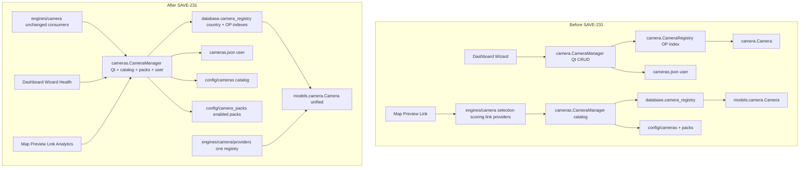

# SAVE-231 — Camera Framework Consolidation

**Verdict: PASS**

## Goal

Unify the duplicate `camera` (user/OP) and `cameras` (catalog/packs) stacks into one architecture.

## Old vs new architecture



## Exactly one of each (confirmed)

| Component | Location |
|-----------|----------|
| CameraManager | `cameras.manager.CameraManager` / `camera_manager` |
| CameraProvider | `engines.camera.providers.base_provider.CameraProvider` |
| Provider registry | `engines.camera.providers.provider_registry` |
| Camera model | `models.camera.Camera` |
| Discovery | `cameras.loader` + `cameras.pack_manager.load_enabled_cameras` |
| Selection | `engines.camera.camera_selection_engine` |
| Preview | `playback.live_camera_workflow` + `gui.widgets.camerapreviewpanel` |

## Removed files

- `src/camera/__init__.py`
- `src/camera/camera.py`
- `src/camera/camera_manager.py`
- `src/camera/camera_registry.py`
- `src/camera/stream_test.py`
- `src/engines/camera/camera_engine.py` (dead BaseEngine stub)

## Updated module tree

```
src/models/camera.py              # unified model + aliases + user serde
src/database/camera_registry.py   # country + observation indexes
src/cameras/
  __init__.py                     # public exports
  manager.py                      # single CameraManager
  loader.py                       # catalog discovery
  pack_manager.py                 # pack enable + payload load
  stream_test.py                  # wizard connectivity (moved)
src/engines/camera/
  providers/                      # HLS/RTSP/YouTube/Snapshot
  camera_selection_engine.py
  scoring_engine.py
  link_manager.py
  …
```

## Import dependency report

```
gui.camerawizard / dashboardpage / system_health
  → cameras (Camera, camera_manager, stream_test)

gui.mappage / camerapreviewpanel / analytics / inspector
  → cameras.camera_manager

engines.camera.{selection,scoring,link}
  → cameras.manager.CameraManager
  → models.camera.Camera

engines.camera.providers
  → models.camera.Camera
  → provider_registry (idempotent register_default_providers)

cameras.manager
  → cameras.loader
  → cameras.pack_manager
  → database.camera_registry
  → models.camera
  → observation.observation_manager (user CRUD only)

Legacy package `camera` — deleted (ModuleNotFoundError confirmed)
```

No circular import crashes on the camera import set (verified).

## Verification

| Check | Result |
|-------|--------|
| Camera Wizard imports + CRUD API | PASS |
| Dashboard `by_observation` | PASS |
| Automatic selection engine | PASS (shared manager) |
| HLS provider supports/open | PASS |
| Provider registration (no duplicates) | PASS |
| Pack discovery → registry | PASS (9 pack cameras when enabled) |
| Catalog load | PASS (HU/AT) |
| Settings diagnostics import | PASS |
| EventBus link event symbols | PASS |
| Unit tests (19, excl. pytest-only gate) | PASS |
| No duplicate Camera model | PASS |
| No dead `src/camera` package | PASS |
| No circular import failure | PASS |

**Overall: PASS**

## Notes

- User cameras keep legacy JSON keys (`type`, `latitude`, …) plus canonical keys for one-file compatibility.
- Wizard aliases (`camera.type`, `.latitude`, …) are properties on the unified model.
- Enabled packs now feed the same registry as the country catalog (previously discover-only).
