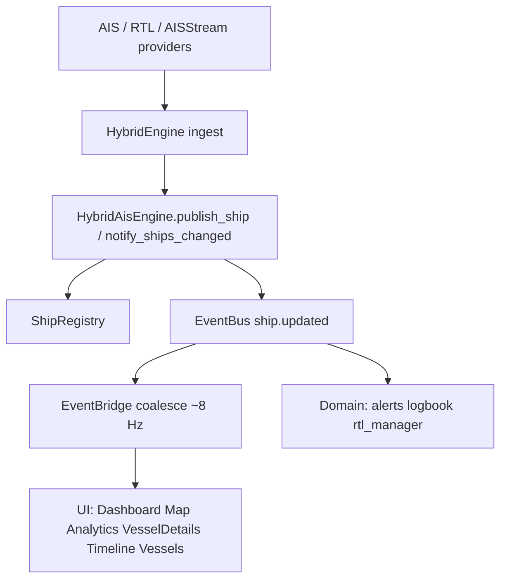

# SAVE-232 — Event Pipeline Consolidation

**Verdict: PASS**

## Canonical flow

**Single publication point:** `engines.ais.hybrid_ais_engine`  
(`publish_ship` for ingest, `notify_ships_changed` for purge/reconnect).

## Publisher / subscriber inventory

### Publishers of `ship.updated`

| Module | Role |
|--------|------|
| `engines/ais/hybrid_ais_engine.py` | **Only** live publisher |

Removed: direct `eventbus.publish("ship.updated")` from `engines/rtl/hybrid_engine.py` (now calls `hybrid_ais_engine.notify_ships_changed()`).

### EventBus subscribers of `ship.updated`

| Subscriber | Type |
|------------|------|
| `gui.eventbridge.EventBridge` | GUI coalesce fan-out |
| `alerts.engine` | Domain |
| `logbook.logbook_recorder` | Domain |
| `rtl.rtl_manager` | Domain |

### UI consumers (EventBridge Qt signals only)

| Consumer | Signal | Notes |
|----------|--------|-------|
| Dashboard | `ship_updated` | via MainWindow |
| Map | `ship_updated` | via MainWindow |
| Vessels page | `ship_updated` | via MainWindow |
| Analytics | `ship_updated` + status/providers | `connect_event_bridge` |
| Vessel Details | `ship_updated` | `connect_event_bridge` from Map binder |
| Timeline | `ship_updated` | name-lookup refresh |

Analytics **polling timer removed**. Alert fired/cleared remain on EventBus (not ship traffic).

## Latency measurements (offscreen)

| Metric | Result |
|--------|--------|
| 20 burst `publish_ship` → EventBridge emits | **1** coalesced emit |
| Time to first GUI emit | **~125 ms** (coalesce interval) |
| Direct GUI EventBus `ship.updated` subscribers | **0** |

## Verification matrix

| Check | Result |
|-------|--------|
| Live AIS path (`publish_ship`) | PASS |
| RTL ingest via HybridEngine → HybridAisEngine | PASS |
| Provider reconnect / purge notify | PASS |
| Vessel Details via EventBridge | PASS |
| Analytics via EventBridge (no timer) | PASS |
| Dashboard / Map via EventBridge | PASS |
| Timeline via EventBridge | PASS |
| No duplicate EventBus ship publishers | PASS |
| No GUI direct `ship.updated` subscribe | PASS |
| Coalesce collapses bursts | PASS |

**Overall: PASS**
